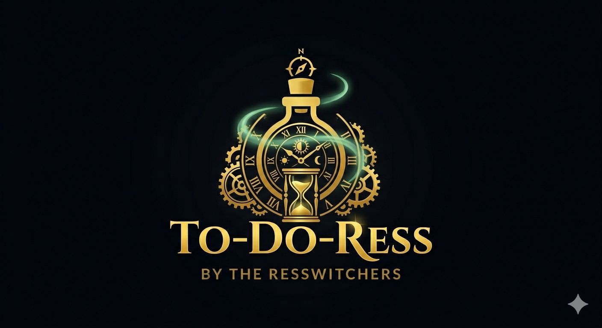

# 🪄 TO-DO-Ress

**Where Magic Meets Productivity** – Transform your tasks into a mystical experience with this luxury 3D to-do list.

A **premium, magical to-do application** featuring immersive 3D visuals, personalized themes, and seamless local persistence. Built for those who demand elegance and enchantment in their productivity tools.

## ✨ Features

- **🌌 Magical 3D Background** – Interactive space nebula powered by Three.js that reacts to scroll with buttery-smooth animations
- **⚔️🌸 Dual Experience Modes** – Choose Boy (Emerald/Gold medieval warrior) or Girl (Rose-Gold/Pink enchanted princess) themes that transform the entire aesthetic
- **📜 Magic Notebook** – Multi-page persistent notebook system for long-form notes, auto-saves across sessions
- **💎 Luxury Glassmorphism UI** – Premium animations, advanced backdrop filters, MedievalSharp typography, and mobile-first responsive design
- **🎮 Smooth Interactions** – Touch/wheel scrolling, raycast task completion, status notifications, and theme persistence via localStorage

## 🛠 Tech Stack

| Frontend | Styling | 3D/Animations | Utilities |
|----------|---------|---------------|-----------|
| HTML5 | CSS3 (Glassmorphism) | Three.js | localStorage |
| Vanilla JavaScript | MedievalSharp Font | Canvas Textures | Responsive Design |

## 🚀 Quick Start

1. Clone or download the repository
2. Open `index.html` in any modern browser
3. Choose your magical style (Boy ⚔️ or Girl 🌸)
4. Start brewing your tasks! ✨

**No setup required** – Zero dependencies, instant magic.

## 📱 Mobile Optimized

Fully responsive across all devices with native touch scrolling and optimized Three.js rendering.

## 💖 Support the Project

Love the magic? Support future enchantments!

## 📞 Contact

Follow the creator: [@ressay.0 on Instagram](https://www.instagram.com/ressay.0/)

---

⭐ **Star this repo if it sparks joy in your productivity rituals!**

